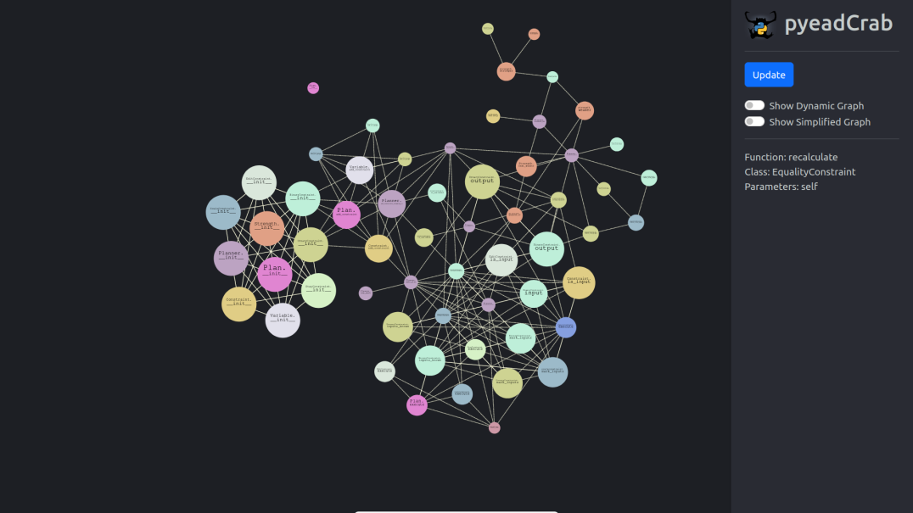
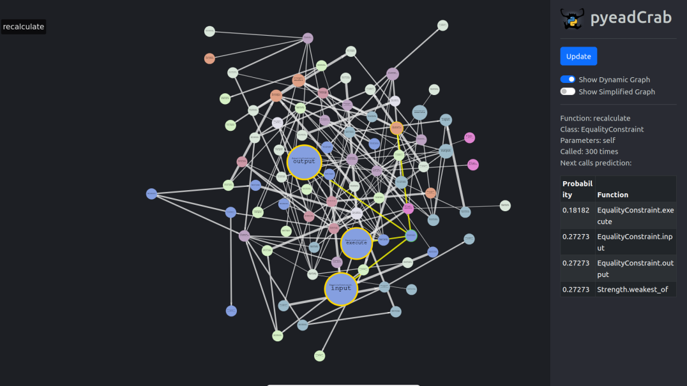

# PyeadCrab (Project2Group8)

PyeadCrab is a code analysis tool designed to do static and dynamic analysis on python repo projects. It focuses on identifying potential areas of interlinked code in addition to applying markov models to dynamically predicted likelihood of calls.

For reference to class based milestones [this file](milestones.md)

---
## Setup
### Backend
1. make sure `python` > 3 is installed 
2. `cd backend`
3. `pip -r install requirements.txt`
4. refer to [this file](backend/readme.md) for how to run on repos

### Frontend
1. make sure you have npm installed
2. `cd frontend`
3. `npm install`
4. `npm start`

---
## Sampple Results
The following is the static and dynamic renders of `samplecode/selected_benchmarks/deltablue` from the command executed in `/backend/` 

`python main.py -d '../samplecode/deltablue/' '../samplecode/deltablue/deltablue.py'` 

and 

`python main.py -s '../samplecode/deltablue/'`

Static Analysis

Dynamic Analysis

